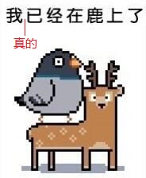

# ChemMiner: A Large Language Model Agent System for Chemical Literature Data Mining
This is the implementation for our paper [ChemMiner: A Large Language Model Agent System for Chemical Literature Data Mining](https://openreview.net/forum?id=H57HtksYpC)

## Literature Input
The literature input is stored in jsonl format. The size of data is too large for github and it can be downloaded from [Google Drive](https://drive.google.com/file/d/1uKBPmtdvT7OHVr5UO8KqsQApjkpXaKH9/view?usp=sharing).

## More Coming Soon (for real)
to be fully open-source after I am done with several approaching deadlines :-)

  

